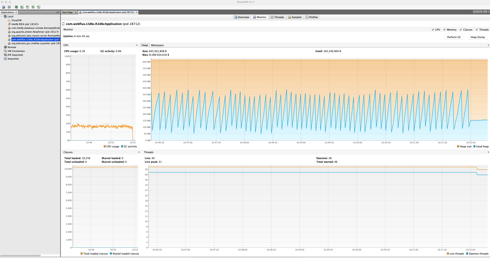

# JDBC vs R2DBC

A POC to compare the performance between JDBC and R2DBC in a reactive web application

## Problem Statement

Given a non-blocking web application build with Spring Webflux that takes a POST request and saves the body 
object into a mysql database table

I want to compare the performance between implementing the persistence layer with JDBC and R2DBC

So I can decide which approach gives the best performance and should be the way forward

## Experiment Setup

### Environment

1. Test Machine: 2020 Macbook Pro, 2.3 GHz Quad-Core Intel I7, 8 processors, 32 GB Memory
2. Test Tools: JMeter and VisualVM
3. Application running locally from IntelliJ, a MySQL database running in docker
4. Database connection pool: min-idle is 50 and max is 200

### Application Setup

The workflow is simple, a REST endpoint takes a POST request with a JSON body which maps to an Order object and get
saved into the database.

|Field      |Type           |Null|Key|
|-----------|---------------|----|---|
|ORDER_ID   |VARCHAR(50)    |NO  |PRI|
|PRODUCT_ID |VARCHAR(50)    |NO  |PRI|
|AMOUNT     |DECIMAL(6,2)   |YES |   |

example Order object:

```json
{
  "orderId": 1,
  "productId": 2,
  "amount": 2.03
}
```
### Test Setup

1. JMeter and VisualVM running in GUI mode
2. JMeter test setup:
    * number of threads: 1000
    * ramp-up time: 20s
    * running in infinite loop, continue for 6 minutes

## Key Results and Conclusion

|                               | Throughput     | max # of threads| CPU usage| Error |
|-------------------------------|----------------|-----------------|----------|-------|
| Webflux + R2DBC                | **1098.0/sec** | **31**          | **20%**  | 0     |
| Webflux + JDBC (Elastic)       | 734.0/sec      | 1029            | 10%      | 0     |
| Webflux + JDBC (BoundedElastic)| 723.3/sec      | 107             | 10%      | 0     |

* With a very small number of threads, pure reactive solution (Webflux + R2DBC) gave the highest throughput and 
  memory usage was also kept at a low level

## Full Results and Images
All evidence are in the *perf* repo
### JMeter Summary
R2DBC:

JDBC + Elastic Pool:

JDBC + BoundedElastic Pool:


### VisualVM Monitor
R2DBC:

JDBC + Elastic Pool:

JDBC + BoundedElastic Pool:

